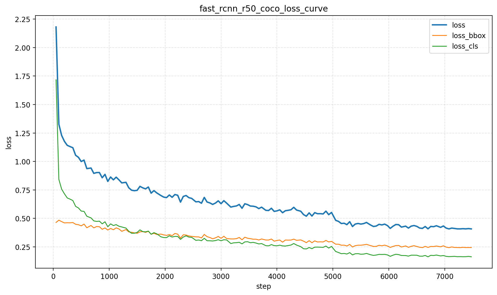
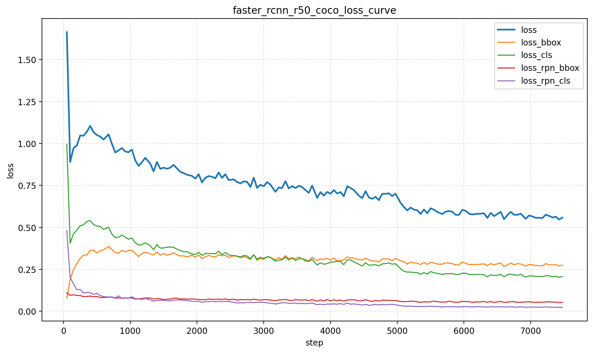

<h1><strong>实验2：目标检测模型综合对比实验</strong></h1>

**组号：** 11  
**组员及分工：** 庄尚文、张煜豪、廖玺

<table style="width: 80%; border-collapse: collapse;" border="1">
  <tr style="background-color: #f5f5f5;">
    <th style="width: 18%; text-align: left;">组员</th>
    <th style="width: 62%; text-align: left;">分工</th>
  </tr>
  <tr>
    <td>庄尚文</td>
    <td>负责 Fast R-CNN、YOLO v3 模型在 COCO 2017 和 VOC 2012 数据集上的训练和测试</td>
  </tr>
  <tr>
    <td>张煜豪</td>
    <td>负责 Faster R-CNN、SSD 模型在 COCO 2017 和 VOC 2012 数据集上的训练和测试</td>
  </tr>
  <tr>
    <td>廖玺</td>
    <td>负责 COCO 2017 和 VOC 2012 数据集的预处理，更换模型 backbone 做实验对比，绘制模型训练曲线并撰写分析</td>
  </tr>
</table>

<h3><strong>一、实验要求</strong></h3>

（1）学习典型目标检测模型的训练，包括 R-CNN、Fast R-CNN、Faster R-CNN、YOLO（选做SSD、DETR）；

（2）在多个数据集上进行训练和测试，并分析实验结果（数据集选择1个以上，如 COCO、VOC 或其他）；

（3）选做：对模型选用不同backbone骨干网络做更多对比分析。

<h3><strong>二、实验环境</strong></h3>

本实验在Linux服务器环境下完成，主要开发环境如下：
- 操作系统：Linux
- Python版本：3.8
- 主要依赖库：mmcv、mmdet、mmengine
- GPU：单张 NVIDIA RTX A6000（48GB）

<h3><strong>三、目标检测模型介绍</strong></h3>

<table style="width: 95%; border-collapse: collapse;" border="1">
  <tr style="background-color: #f5f5f5;">
    <th style="width: 14%; text-align: left; padding: 8px;">模型</th>
    <th style="width: 12%; text-align: left; padding: 8px;">类型</th>
    <th style="text-align: left; padding: 8px;">工作原理</th>
  </tr>
  <tr>
    <td style="padding: 8px;">R-CNN</td>
    <td style="padding: 8px;">Two-stage</td>
    <td style="padding: 8px;">首先使用选择性搜索（Selective Search）生成候选区域（Region Proposals），然后将每个候选区域单独送入 CNN 提取特征，最后使用分类器进行目标分类和边界框回归，即将检测问题分为候选区域生成和分类两个阶段。</td>
  </tr>
  <tr>
    <td style="padding: 8px;">Fast R-CNN</td>
    <td style="padding: 8px;">Two-stage</td>
    <td style="padding: 8px;">在整张图像上仅进行一次卷积计算生成特征图，然后通过 ROI Pooling 从特征图中提取各候选区域的固定尺寸特征，最后进行分类和回归。</td>
  </tr>
  <tr>
    <td style="padding: 8px;">Faster R-CNN</td>
    <td style="padding: 8px;">Two-stage</td>
    <td style="padding: 8px;">引入区域建议网络（RPN）替代传统候选区域生成方法，实现候选区域的端到端学习，RPN 与检测网络共享特征提取层，检测流程更加高效和统一。</td>
  </tr>
  <tr>
    <td style="padding: 8px;">YOLO</td>
    <td style="padding: 8px;">One-stage</td>
    <td style="padding: 8px;">将目标检测任务转化为单次回归问题，直接从整张图像预测目标的类别和 bounding box。通过将图像划分为网格并同时预测多个目标，实现高检测速度，适用于实时检测任务。</td>
  </tr>
  <tr>
    <td style="padding: 8px;">SSD</td>
    <td style="padding: 8px;">One-stage</td>
    <td style="padding: 8px;">在多个尺度的特征图上进行检测，在不同层级上预测不同尺寸的目标。通过引入 Default Boxes 机制，使模型在保持较高速度的同时提升对多尺度目标的检测能力。</td>
  </tr>
  <tr>
    <td style="padding: 8px;">DETR</td>
    <td style="padding: 8px;">Transformer</td>
    <td style="padding: 8px;">将目标检测建模为集合预测问题，使用 Transformer 结构进行全局特征建模，通过自注意力机制直接预测固定数量的目标集合，并使用匈牙利匹配进行监督，从而避免传统方法中的 NMS 后处理步骤。</td>
  </tr>
</table>

<h3><strong>四、数据集介绍</strong></h3>

本实验选择 COCO 2017 和 VOC 2012 两个数据集，并分别对目标检测模型进行训练和测试评估。数据集的基本情况对比如下：

<table style="border-collapse: collapse; width: 70%;" border="1">
  <tr style="background-color: #f5f5f5;">
    <th style="text-align: left; padding: 8px;">数据集</th>
    <th style="text-align: left; padding: 8px;">COCO 2017</th>
    <th style="text-align: left; padding: 8px;">VOC 2012</th>
  </tr>
  <tr>
    <td style="padding: 8px;">类别数</td>
    <td style="padding: 8px;">80</td>
    <td style="padding: 8px;">20</td>
  </tr>
  <tr>
    <td style="padding: 8px;">数据规模</td>
    <td style="padding: 8px;">大</td>
    <td style="padding: 8px;">小</td>
  </tr>
  <tr>
    <td style="padding: 8px;">场景复杂度</td>
    <td style="padding: 8px;">高（多目标密集分布）</td>
    <td style="padding: 8px;">较低（目标数量较少）</td>
  </tr>
  <tr>
    <td style="padding: 8px;">小目标情况</td>
    <td style="padding: 8px;">多</td>
    <td style="padding: 8px;">少</td>
  </tr>
</table>

由于 COCO 数据集的数据量过于庞大，本实验仅选择 train split 中的前10000条数据进行训练，测试选择 val split 的5000条数据。同时，本实验对 VOC 2012 数据集按照训练集:验证集:测试集=7:2:1的比例重新进行了划分，因此最终用于本实验的训练和测试样本数情况如下：

<table style="border-collapse: collapse; width: 70%;" border="1">
  <tr style="background-color: #f5f5f5;">
    <th style="text-align: left; padding: 8px;">数据集</th>
    <th style="text-align: left; padding: 8px;">COCO 2017</th>
    <th style="text-align: left; padding: 8px;">VOC 2012</th>
  </tr>
  <tr>
    <td style="padding: 8px;">训练样本数</td>
    <td style="padding: 8px;">10000</td>
    <td style="padding: 8px;">11987</td>
  </tr>
  <tr>
    <td style="padding: 8px;">测试样本数</td>
    <td style="padding: 8px;">5000</td>
    <td style="padding: 8px;">1713</td>
  </tr>
</table>

<h3><strong>五、实验结果</strong></h3>

#### 5.1 模型训练

本实验选择 Fast R-CNN、Faster R-CNN、YOLO v3 以及 SSD 模型在两个数据集上分别进行训练和测试。模型的 backbone 以及基本的训练参数设置如下，其中 SSD 模型采用了两套 Batch Size 和 Learning Rate 的训练设置进行对比：

<table style="border-collapse: collapse; width: 95%;" border="1">
  <tr style="background-color: #f5f5f5;">
    <th style="text-align: left; padding: 8px;">模型</th>
    <th style="text-align: left; padding: 8px;">Backbone</th>
    <th style="text-align: left; padding: 8px;">Batch Size</th>
    <th style="text-align: left; padding: 8px;">Learning Rate</th>
    <th style="text-align: left; padding: 8px;">Epoch</th>
  </tr>
  <tr>
    <td style="padding: 8px;">Fast R-CNN</td>
    <td style="padding: 8px;">ResNet-50</td>
    <td style="padding: 8px;">16</td>
    <td style="padding: 8px;">0.02</td>
    <td style="padding: 8px;">12</td>
  </tr>
  <tr>
    <td style="padding: 8px;">Faster R-CNN</td>
    <td style="padding: 8px;">ResNet-50</td>
    <td style="padding: 8px;">16</td>
    <td style="padding: 8px;">0.02</td>
    <td style="padding: 8px;">12</td>
  </tr>
  <tr>
    <td style="padding: 8px;">SSD（配置1）</td>
    <td style="padding: 8px;">VGG16</td>
    <td style="padding: 8px;">16</td>
    <td style="padding: 8px;">0.0005</td>
    <td style="padding: 8px;">24</td>
  </tr>
  <tr>
    <td style="padding: 8px;">SSD（配置2）</td>
    <td style="padding: 8px;">VGG16</td>
    <td style="padding: 8px;">8</td>
    <td style="padding: 8px;">0.002</td>
    <td style="padding: 8px;">24</td>
  </tr>
  <tr>
    <td style="padding: 8px;">YOLO v3</td>
    <td style="padding: 8px;">Darknet-53</td>
    <td style="padding: 8px;">16</td>
    <td style="padding: 8px;">0.00025</td>
    <td style="padding: 8px;">231</td>
  </tr>
</table>

模型在 COCO 数据集上的训练过程：

<table style="width: 100%; border-collapse: collapse; border: none; text-align: center;">
  <tr>
    <td style="width: 50%; padding: 8px; border: none;">
      
    </td>
    <td style="width: 50%; padding: 8px; border: none;">
      
    </td>
  </tr>
  <tr>
    <td style="padding: 4px; border: none;">图1 Fast R-CNN 在 COCO 上的训练损失曲线</td>
    <td style="padding: 4px; border: none;">图2 Faster R-CNN 在 COCO 上的训练损失曲线</td>
  </tr>
</table>

<table style="width: 100%; border-collapse: collapse; border: none; text-align: center;">
  <tr>
    <td style="width: 50%; padding: 8px; border: none;">
      
    </td>
    <td style="width: 50%; padding: 8px; border: none;">
      
    </td>
  </tr>
  <tr>
    <td style="padding: 4px; border: none;">图3 SSD（配置1） 在 COCO 上的训练损失曲线</td>
    <td style="padding: 4px; border: none;">图4 SSD（配置2） 在 COCO 上的训练损失曲线</td>
  </tr>
</table>

<table style="width: 100%; border-collapse: collapse; border: none; text-align: center;">
  <tr>
    <td style="width: 50%; padding: 8px; border: none;">
      
    </td>
    <td style="width: 50%; padding: 8px; border: none;"></td>
  </tr>
  <tr>
    <td style="padding: 4px; border: none;">图5 YOLO v3 在 COCO 上的训练损失曲线</td>
    <td style="padding: 4px; border: none;"></td>
  </tr>
</table>

模型在 VOC 数据集上的训练过程：

<table style="width: 100%; border-collapse: collapse; border: none; text-align: center;">
  <tr>
    <td style="width: 50%; padding: 8px; border: none;">
      
    </td>
    <td style="width: 50%; padding: 8px; border: none;">
      
    </td>
  </tr>
  <tr>
    <td style="padding: 4px; border: none;">图6 Fast R-CNN 在 VOC 上的训练损失曲线</td>
    <td style="padding: 4px; border: none;">图7 Faster R-CNN 在 VOC 上的训练损失曲线</td>
  </tr>
</table>

<table style="width: 100%; border-collapse: collapse; border: none; text-align: center;">
  <tr>
    <td style="width: 50%; padding: 8px; border: none;">
      
    </td>
    <td style="width: 50%; padding: 8px; border: none;">
      
    </td>
  </tr>
  <tr>
    <td style="padding: 4px; border: none;">图8 SSD（配置1） 在 VOC 上的训练损失曲线</td>
    <td style="padding: 4px; border: none;">图9 SSD（配置2） 在 VOC 上的训练损失曲线</td>
  </tr>
</table>

<table style="width: 100%; border-collapse: collapse; border: none; text-align: center;">
  <tr>
    <td style="width: 50%; padding: 8px; border: none;">
      
    </td>
    <td style="width: 50%; padding: 8px; border: none;"></td>
  </tr>
  <tr>
    <td style="padding: 4px; border: none;">图10 YOLO v3 在 VOC 上的训练损失曲线</td>
    <td style="padding: 4px; border: none;"></td>
  </tr>
</table>

从训练过程来看，各模型的损失曲线整体都呈现出随迭代逐步下降的趋势，说明所采用的训练配置能够使模型趋于收敛。其中，Fast R-CNN 和 Faster R-CNN 在 COCO 与 VOC 两个数据集上的收敛过程都较为平滑，后期波动较小，表现出较好的训练稳定性。SSD 模型在两组参数设置下均能趋于收敛，且配置2（Batch Size=8，Learning Rate=0.002）整体优于较小的学习率配置，表明适当增大学习率有助于提升 SSD 的优化效率。YOLO v3 由于Learning Rate设置较为保守，因此训练轮数最多，前期损失下降较快，后期进入缓慢收敛阶段，但是由于训练轮数、学习率设置以及数据集复杂度等原因，距离最终收敛还有一定的距离。总体来看，由于 VOC 数据集类别数较少、场景复杂度较低，因此各模型更容易收敛，而 COCO 中小目标多、场景更复杂，使得模型的训练难度加大。

#### 5.2 模型测试

上述训练完成后，本实验取模型在训练阶段的最后一个 epoch 的权重进行测试。

在 COCO 数据集上的测试结果如下：

<table style="border-collapse: collapse; width: 95%;" border="1">
  <tr style="background-color: #f5f5f5;">
    <th style="text-align: left; padding: 8px;">模型</th>
    <th style="text-align: left; padding: 8px;">AP@[0.5:0.95]</th>
    <th style="text-align: left; padding: 8px;">AP50</th>
    <th style="text-align: left; padding: 8px;">AP75</th>
  </tr>
  <tr>
    <td style="padding: 8px;">Fast R-CNN</td>
    <td style="padding: 8px;">0.219</td>
    <td style="padding: 8px;">0.416</td>
    <td style="padding: 8px;">0.206</td>
  </tr>
  <tr>
    <td style="padding: 8px;">Faster R-CNN</td>
    <td style="padding: 8px;">0.222</td>
    <td style="padding: 8px;">0.415</td>
    <td style="padding: 8px;">0.214</td>
  </tr>
  <tr>
    <td style="padding: 8px;">SSD（配置1）</td>
    <td style="padding: 8px;">0.136</td>
    <td style="padding: 8px;">0.279</td>
    <td style="padding: 8px;">0.118</td>
  </tr>
  <tr>
    <td style="padding: 8px;">SSD（配置2）</td>
    <td style="padding: 8px;">0.160</td>
    <td style="padding: 8px;">0.303</td>
    <td style="padding: 8px;">0.152</td>
  </tr>
  <tr>
    <td style="padding: 8px;">YOLO v3</td>
    <td style="padding: 8px;">0.153</td>
    <td style="padding: 8px;">0.307</td>
    <td style="padding: 8px;">0.138</td>
  </tr>
</table>

在 VOC 数据集上（采用 COCO 评测指标）的测试结果如下：

<table style="border-collapse: collapse; width: 95%;" border="1">
  <tr style="background-color: #f5f5f5;">
    <th style="text-align: left; padding: 8px;">模型</th>
    <th style="text-align: left; padding: 8px;">AP@[0.5:0.95]</th>
    <th style="text-align: left; padding: 8px;">AP50</th>
    <th style="text-align: left; padding: 8px;">AP75</th>
  </tr>
  <tr>
    <td style="padding: 8px;">Fast R-CNN</td>
    <td style="padding: 8px;">0.382</td>
    <td style="padding: 8px;">0.647</td>
    <td style="padding: 8px;">0.407</td>
  </tr>
  <tr>
    <td style="padding: 8px;">Faster R-CNN</td>
    <td style="padding: 8px;">0.386</td>
    <td style="padding: 8px;">0.649</td>
    <td style="padding: 8px;">0.408</td>
  </tr>
  <tr>
    <td style="padding: 8px;">SSD（配置1）</td>
    <td style="padding: 8px;">0.355</td>
    <td style="padding: 8px;">0.598</td>
    <td style="padding: 8px;">0.365</td>
  </tr>
  <tr>
    <td style="padding: 8px;">SSD（配置2）</td>
    <td style="padding: 8px;">0.366</td>
    <td style="padding: 8px;">0.599</td>
    <td style="padding: 8px;">0.388</td>
  </tr>
  <tr>
    <td style="padding: 8px;">YOLO v3</td>
    <td style="padding: 8px;">0.363</td>
    <td style="padding: 8px;">0.592</td>
    <td style="padding: 8px;">0.398</td>
  </tr>
</table>

从测试结果来看，不同模型在 COCO 和 VOC 两个数据集上的性能差异较为明显。整体上，VOC 数据集上的检测效果普遍优于 COCO 数据集，这主要是因为 VOC 类别数较少、场景相对简单、目标尺度分布更集中，而 COCO 包含更多小目标与复杂背景，对模型的定位和分类能力要求更高。在 COCO 数据集上，Faster R-CNN 的综合表现最好，`AP@[0.5:0.95]` 达到 0.222，略高于 Fast R-CNN 的 0.219，SSD 和 YOLO v3 的结果分别为 0.160 和 0.153，整体略低，主要是由于训练阶段学习率和训练周期设置较为保守，导致模型还未收敛完全。VOC 数据集上的结果整体更高，其中 Faster R-CNN 取得了最优性能，`AP@[0.5:0.95]` 为 0.386，Fast R-CNN 为 0.382，SSD 在调整参数后可达到 0.366，YOLO v3 为 0.363，说明在较简单的数据集上，各模型都能取得较好的检测效果。进一步从 `AP50` 和 `AP75` 来看，各模型在 `AP50` 下的结果明显高于 `AP@[0.5:0.95]`，表明模型在较宽松 IoU 阈值下能够较好完成目标检出，但在更严格的定位要求下性能会有所下降。

#### 5.3 不同backbone的影响

本实验进一步探究了不同 backbone 对模型训练和测试效果的影响，这部分实验选择 Faster R-CNN 模型，backbone 分别选择 ResNet-50 和 ResNet-101，并在 COCO 数据集上进行训练和测试，训练参数设置与5.1中保持相同，训练过程对比如下：

<table style="width: 100%; border-collapse: collapse; border: none; text-align: center;">
  <tr>
    <td style="width: 50%; padding: 8px; border: none;">
      
    </td>
    <td style="width: 50%; padding: 8px; border: none;">
      
    </td>
  </tr>
  <tr>
    <td style="padding: 4px; border: none;">图11 backbone 为 ResNet-50 的训练损失曲线</td>
    <td style="padding: 4px; border: none;">图12 backbone 为 ResNet-101 的训练损失曲线</td>
  </tr>
</table>

测试结果对比如下：

<table style="border-collapse: collapse; width: 95%;" border="1">
  <tr style="background-color: #f5f5f5;">
    <th style="text-align: left; padding: 8px;">Backbone</th>
    <th style="text-align: left; padding: 8px;">AP@[0.5:0.95]</th>
    <th style="text-align: left; padding: 8px;">AP50</th>
    <th style="text-align: left; padding: 8px;">AP75</th>
  </tr>
  <tr>
    <td style="padding: 8px;">ResNet-50</td>
    <td style="padding: 8px;">0.222</td>
    <td style="padding: 8px;">0.415</td>
    <td style="padding: 8px;">0.214</td>
  </tr>
  <tr>
    <td style="padding: 8px;">ResNet-101</td>
    <td style="padding: 8px;">0.245</td>
    <td style="padding: 8px;">0.444</td>
    <td style="padding: 8px;">0.242</td>
  </tr>
</table>

对 Faster R-CNN 分别采用 ResNet-50 和 ResNet-101 进行实验，可以发现在其余训练设置一致的条件下，更深的 ResNet-101 表现出更好的检测效果：采用 ResNet-50 时，模型的 `AP@[0.5:0.95]` 为 0.222，`AP50` 为 0.415，`AP75` 为 0.214；而采用 ResNet-101 后，这三项指标分别提升至 0.245、0.444 和 0.242，说明更深层的 backbone 具有更强的特征提取与语义表达能力，能够为后续检测头提供更加丰富的多尺度特征表示，从而提升整体检测精度。结合训练过程可以看出，ResNet-101 在收敛稳定性上与 ResNet-50 基本一致，但由于网络更深、参数量更大，其训练耗时和显存占用也明显增加。因此，较深的 backbone 有助于提升检测性能，但也会带来更高的计算开销。

<h3><strong>六、实验总结</strong></h3>

通过本次实验，我们完成了 Fast R-CNN、Faster R-CNN、SSD 和 YOLO v3 等典型目标检测模型在 COCO 2017 和 VOC 2012 数据集上的训练与测试，并对不同模型及不同 backbone 的表现进行了比较分析。实验结果表明，目标检测模型的最终性能不仅与模型结构有关，还与训练参数设置、优化策略等密切相关。在本次实验中，不同模型在 Batch Size、Learning Rate、训练轮数和 backbone 配置不同时，最终收敛速度和测试结果均表现出较明显差异。例如 SSD 在不同 Batch Size 和 Learning Rate 设置下的结果存在一定变化，说明训练时合理的超参数选择对模型性能具有重要影响。因此在目标检测任务中，除了关注模型本身的结构特点外，还需要结合具体任务对训练配置进行针对性调整，才能获得更稳定、更有效的实验结果。同时，实验也说明了数据集特性对检测结果有重要影响。相较于 COCO 数据集，VOC 数据集类别更少、场景相对简单，因此各模型在 VOC 上的检测效果整体更好，更容易收敛。进一步的 backbone 对比实验表明，更深的特征提取网络能够提升模型的表征能力，例如将 Faster R-CNN 的 backbone 从 ResNet-50 更换为 ResNet-101 后，模型的检测精度进一步提高，但也带来了更高的计算和存储开销。总体而言，本实验加深了我们对目标检测模型结构特点、训练流程、评测指标以及模型性能差异的理解，也说明在实际任务中需要结合精度要求、实时性需求和硬件资源条件，综合选择合适的检测模型与网络结构。

